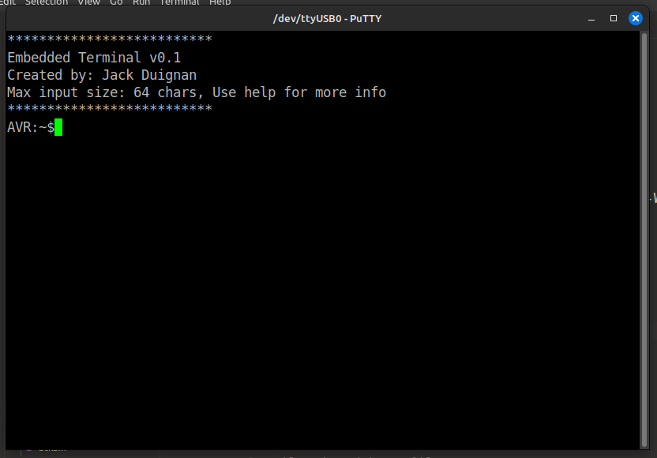

# Embedded Terminal

This is a terminal designed to run on the avr series of micro controller which offers some basic functions.

A screenshot of the welcome message can be seen below:



## Documentation

### Commands

`help`: View the available commands and get general information about the system.

`clear`: Clear the terminal screen using the VT100 escape sequence.

`led`: Toggle an lead connected to a specific pin (in this case pin 13 on the arduino uno)

### Testing

This project uses the [unity](https://github.com/ThrowTheSwitch/Unity) test framework to allow unity testing. This is supplemented by the [FFF](https://github.com/meekrosoft/fff) Fake Function Framework used for faking where needed. The tests are located in `./tests/` and can be run using:

```bash

```

## ToDo

### Admin

- [x] Build script for libraries
- [x] Build script for source
- [x] Build script for project

### Features

- [ ] I2C library
- [ ] Add display module
- [ ] Finish IO module
- [ ] Add EEPROM module
- [ ] Add pipeing operator

### Bug Fix

- [x] Fix `getopt()`
- [x] Fix argument memory leak - This is caused by not freeing the input array.
- [ ] Re write the cmd extract function to be more clear.

## Setup

A full installation and setup process can be found in [SETUP](./SETUP.md)

But assuming the target device is ATMEL Mega328P (Arduino Uno) then the device can be programmed using:

```bash
make flash serial
```

in the `./src/` directory.

### Serial monitor settings

| Setting | Value |
| ------ | --------- |
| EOL sent | `\n` |
| EOL reciving | `\r\n` |
| Baud Rate | `56700` |
| Encoding | `8n1` |

To interact with the terminal use a serial monitor. The author recommends using putty which can be installed using:

```bash
sudo apt install putty
```
